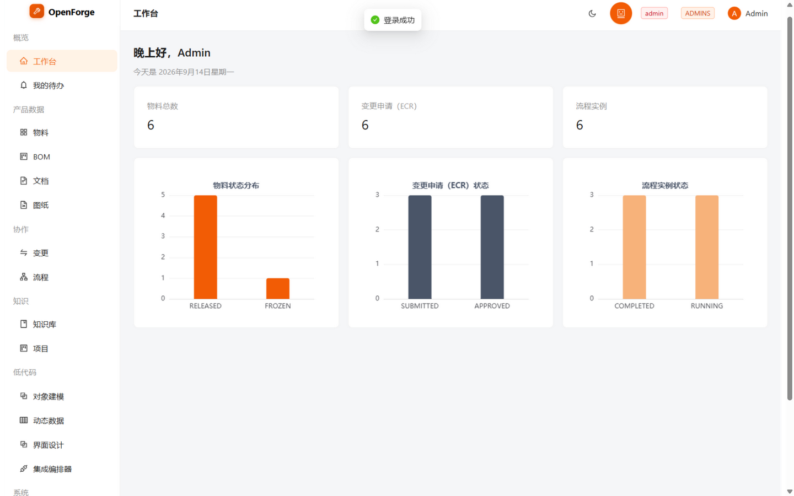
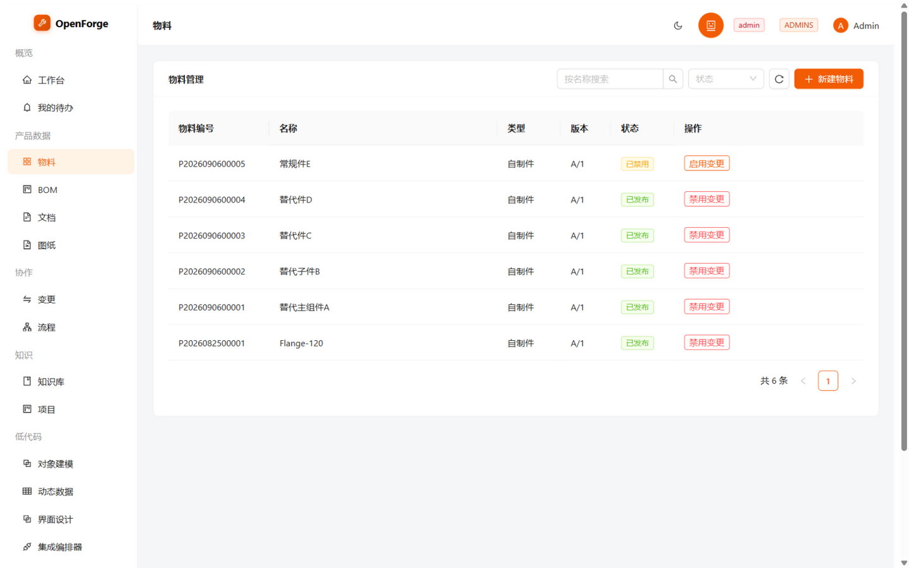
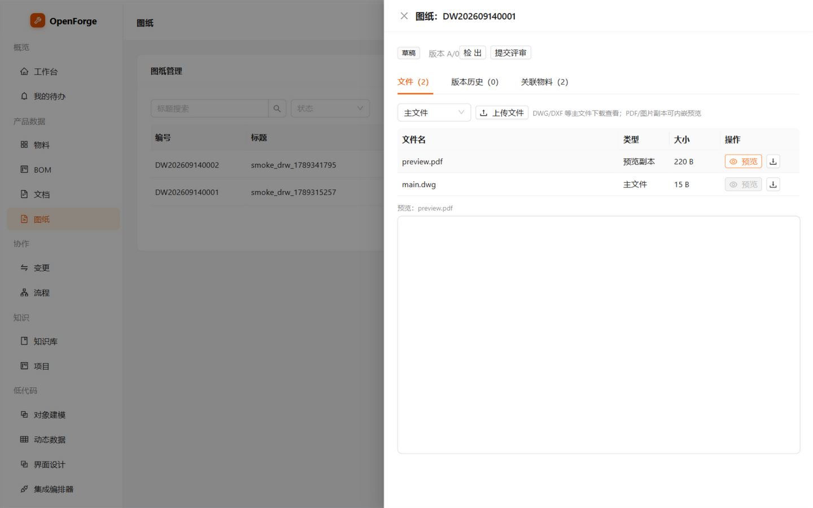
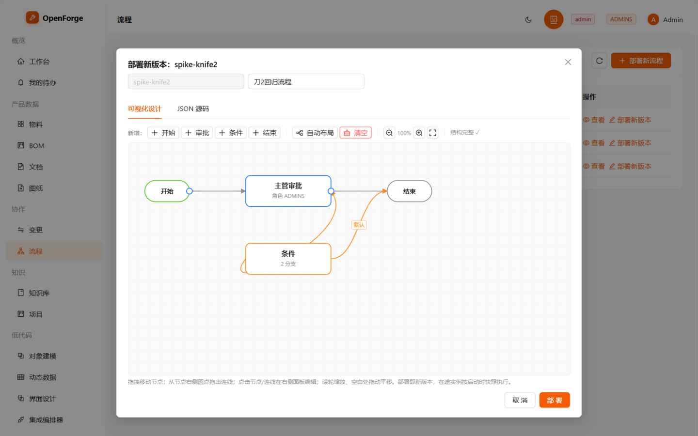
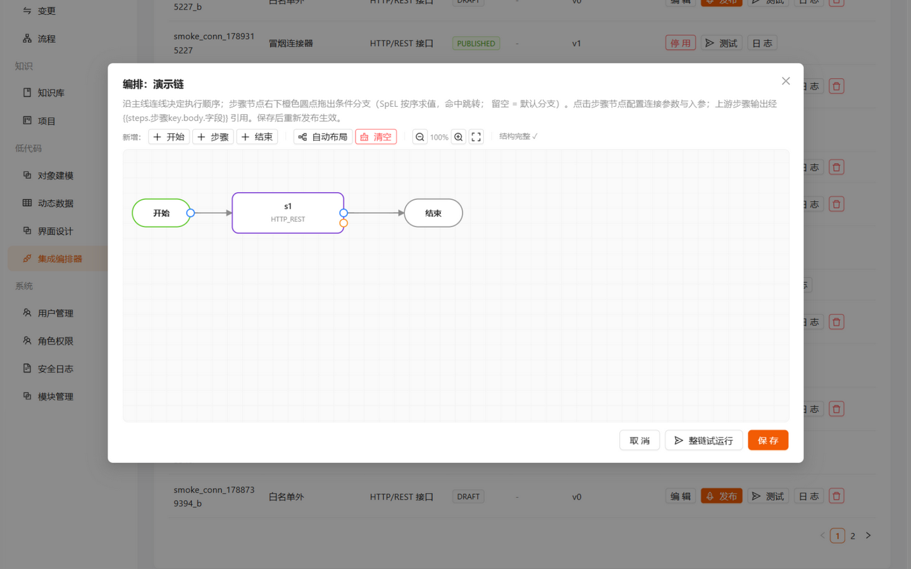
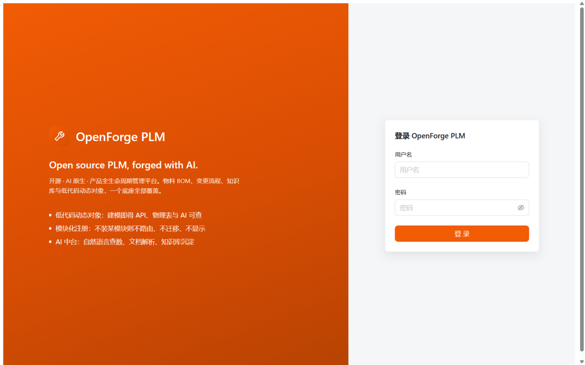
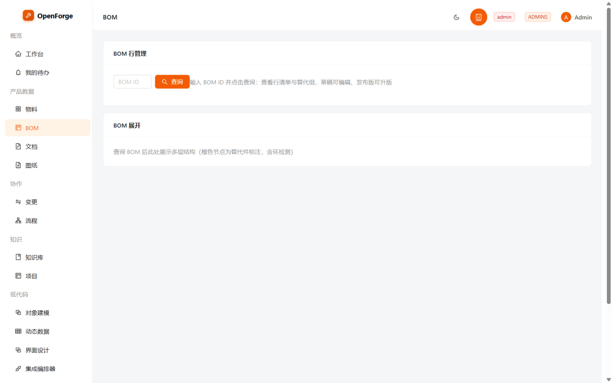
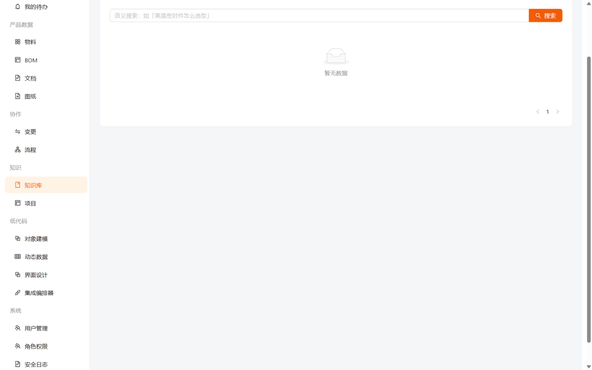
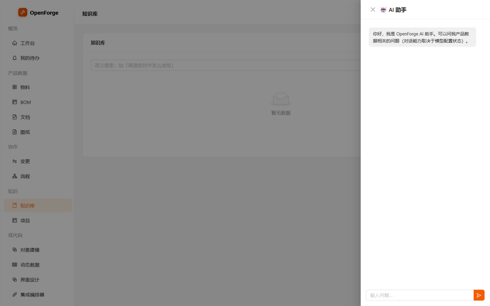
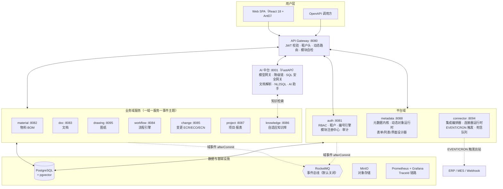

<div align="center">

# 🔨 OpenForge PLM

**Open source PLM, forged with AI.**

**开源 · AI 原生 · 产品全生命周期管理平台**

`Open` 开源开放 ｜ `Forge` 锻造熔炉 ｜ `PLM` 产品全生命周期管理

[]()
[]()
[]()
[]()
[]()
[]()

**中文** — 面向现代制造业的开源产品全生命周期管理系统。AI 不是外挂，而是平台基础设施：自然语言直接查询与操作业务数据、随业务使用持续进化的自适应知识库、业务人员可自行搭建的流程与表单。核心域用专业代码保证深度与性能，长尾需求用低代码配置实现天级交付。

**English** — An open-source, AI-native PLM platform for modern manufacturing: built-in AI agents operating your data via natural language, a self-adaptive knowledge base, and a low-code engine for objects, forms and workflows — all forged in one open platform.

**⭐ 如果这个项目对你有价值，欢迎 Star 关注进展**

</div>

---

## 🖥️ 界面一览

真实环境截图（本地 dev 栈，中文界面开箱即用）：

| 工作台（业务总览仪表盘） | 物料主数据（分类树 + 列表） |
|:---:|:---:|
|  |  |

| 图纸管理（文件 + PDF 内嵌预览 + 物料关联） | 可视化流程设计器（自研 SVG 画布，零依赖） |
|:---:|:---:|
|  |  |

| 集成编排链画布（多步骤 + 条件分支） | 品牌化登录页（暗色模式支持） |
|:---:|:---:|
|  |  |

<details>
<summary>📚 更多界面（BOM / 知识库 / AI 助手）</summary>

| BOM 多视图管理 | 知识库（混合语义搜索） | AI 助手（对话式操作） |
|:---:|:---:|:---:|
|  |  |  |

</details>

---

## ✨ 核心特性

| | 特性 | 说明 |
|---|------|------|
| 🔧 | **通用 PLM 内核** | 物料与多视图 BOM（EBOM/PBOM/MBOM、替代组、where-used 反查）、图纸管理（版本/审签/物料关联/预览）、文档版本与检入检出、三级变更管理（ECR→ECO→ECN）、项目管理 |
| 🤖 | **内置 AI（非外挂）** | AI 中台统一接入多模型（GLM/Qwen/私有化 vLLM）：文档智能解析、BOM 智能清洗、变更影响分析、混合语义搜索、对话式 AI 助手 |
| 💬 | **AI 数据操作** | 自然语言 → 数据操作："帮我新增一个 45# 钢的法兰盘"。API 通道优先 + SQL 安全网关五层校验 + L1~L4 分级确认，AI 权限永远是用户权限的子集 |
| 🧠 | **自适应知识库** | 三层知识（系统元数据/业务知识/使用行为）：数据库结构变更自动同步为 AI 的"系统地图"；变更案例自动沉淀；反馈回流驱动检索持续进化 |
| ⚙️ | **流程定制化** | 自研 SVG 画布可视化流程设计器（零依赖）+ 低代码表单/列表设计器；会签/或签/驳回回退；流程包版本化 + 在途实例快照 + 灰度发布 |
| 🧱 | **低代码平台** | 元数据驱动内核：七大设计器（对象/表单/列表/流程/规则/报表/集成）+ 动态对象运行时。新对象建模发布后，零代码获得 CRUD API 与可配置界面，AI 立即可查 |
| 🔌 | **集成编排器** | HTTP/JDBC 连接器 + 多步骤编排链（画布可视化、步骤上下文传参、SpEL 条件分支）+ EVENT/CRON 触发 + 应用级死信队列——"物料发布 → 自动推 ERP"开箱即用 |
| 🛡️ | **企业级安全** | 多租户全链路隔离（JWT/网关/SQL 行级）、凭据 AES-256-GCM 加密 + 主密钥轮换、出站白名单 + SSRF 固定解析（R6 已闭环）、界面级 RBAC 权限矩阵、跨服务操作审计 |
| 🤝 | **多智能体 + Loop Engineering** | 开发平面（Agent 团队开发本系统）与运行平面（AI 功能 MAS 化）同构；所有智能体产出必须通过"生成→验证→修正"闭环，确定性验证优先，LLM 永不终审 |

---

## 🏗️ 系统架构

**11 个微服务**（Java 21 / Spring Boot 3）+ AI 网关（Python FastAPI）+ React 18 SPA，模块注册表驱动——部署即注册、停用即摘除：



<details>
<summary><b>📐 架构要点（点击展开）</b></summary>

- **模块注册表驱动**：各服务持自描述 `module/<svc>.yml`，启动时向 auth 注册中心上报（60s 心跳）；网关 30s 轮询生成动态路由，模块停用即摘除、依赖未启用标 BROKEN 并暴露原因（`/actuator/module-routes` 可观测）。
- **事件总线（B2）**：RocketMQ 一域一 topic + outbox 事务内原子落库 + relay 补发 + 幂等消费 + 应用级死信；`EVENT_ENABLED=false` 自动回退同步 HTTP（本地/CI 零依赖）。
- **mono 单进程模式**：`PROFILE=mono` 两进程跑全栈（11 模块聚合单上下文 + 独立 gateway），实测 RSS **405MB（较 11 服务独立部署 -78%）**。
- **多租户**：JWT 租户声明 → 网关信任头 → MyBatis-Plus 行级拦截器全表自动过滤；文件按 `tenant/{id}/` 前缀隔离。
- **低代码闭环**：对象建模 → 发布（DDL 生成 + 权限点注册 + AI 登记）→ 动态 CRUD → 表单/列表/界面设计器，全程零重启。
</details>

---

## 🛠️ 技术栈

| 层 | 技术 |
|----|------|
| **前端** | React 18 · TypeScript · Ant Design 5 · ECharts · Vite（自研 SVG 画布流程/编排设计器，零画布库依赖） |
| **后端** | Java 21 · Spring Boot 3.3 · Spring Cloud（Nacos 可选）· MyBatis-Plus · Flyway 多服务迁移 · 11 微服务 + starter 三件套 |
| **AI** | Python FastAPI · OpenAI 兼容协议 · GLM/Qwen/私有化 vLLM 多模型降级链 · 支持全私有化与离线降级 |
| **存储** | PostgreSQL 16 + pgvector（HNSW 混合检索）· MinIO · RocketMQ（可选）· Redis（可选） |
| **工程** | GitHub Actions 三语言 CI · Testcontainers 真实 PG 测试矩阵 · 一键 dev-up/smoke.sh 35 断言冒烟 · Prometheus + Grafana 模板 |

---

## 🚀 快速开始

```bash
git clone https://github.com/Shzyhao/OpenForge-PLM.git
cd OpenForge-PLM

# 一键启动（PG 容器 + 11 个 Java 服务；无源码改动自动跳过构建）
./scripts/dev-up.sh
# PROFILE=mono ./scripts/dev-up.sh     # 最省：mono+gateway 两进程（实测 RSS 405MB）
# PROFILE=core ./scripts/dev-up.sh     # 瘦身：仅主链路（16GB 开发机推荐）
# NACOS=1 ./scripts/dev-up.sh          # 可选：Nacos 服务注册+配置中心

# AI 网关与前端（另开终端）
cd ai && pip install -r requirements.txt && uvicorn gateway.main:app --port 8001
cd frontend && npm install && npm run dev   # http://localhost:5173

# 网关链路冒烟（登录→注册表自检→10 业务域穿透 + 连接器/触发/死信/审计/图纸 35 断言）
./scripts/smoke.sh

# 停止
./scripts/dev-down.sh
```

> 首登：`admin`，初始密码打印在 auth 启动日志（`/tmp/openforge-auth.log`），首登强制改密。

---

## 📚 文档导航

| 文档 | 内容 |
|------|------|
| [开发文档](docs/OpenForge-开发文档.md) | 功能规格、数据库设计、API 规范、里程碑 |
| [架构文档](docs/OpenForge-架构文档.md) | 分层架构、C4 视图、低代码平台架构、ADR、部署 |
| [多智能体与 Loop Engineering](docs/OpenForge-多智能体与LoopEngineering.md) | 双平面 MAS、四层循环验证体系、Agent 基础设施 |
| [集成编排器 MVP 设计](docs/OpenForge-集成编排器MVP设计.md) | 连接器/凭据/链编排/触发/死信/SSRF 根治全记录 |
| [图纸管理设计](docs/OpenForge-图纸管理设计.md) | 图纸域档案/版本/审签/物料关联/预览 |
| [B2 事件总线设计](docs/OpenForge-B2事件总线设计.md) | 信封/拓扑/幂等/outbox 分期 |
| [F2 动态对象运行时](docs/OpenForge-F2动态对象运行时设计.md) ｜ [F2 模块注册机制](docs/OpenForge-F2模块注册机制设计.md) | 低代码内核与模块化机制 |
| [mono 单进程设计](docs/OpenForge-mono单进程设计.md) | 11 模块聚合、-78% 内存实测 |
| [性能与容量画像](docs/OpenForge-性能与容量画像.md) | JVM/池/缓存调优与自检清单 |
| [二次开发指南](docs/OpenForge-二开指南.md) | 新服务接入/密钥轮换/扩展开发 |
| [权限体系完善方案](docs/OpenForge-权限体系完善方案.md) ｜ [框架化路线](docs/OpenForge-框架化路线.md) ｜ [替代件与变更设计](docs/OpenForge-替代件与主数据变更设计.md) | 专项设计全集 |

---

## 🗺️ Roadmap

**M1~M6 产品主线 + 权限专项 + 框架化 F1~F3 + v1.4~v1.20.0 全部交付** ✅

| 阶段 | 交付内容 |
|------|---------|
| **M1~M6 产品主线** | 认证/RBAC/组织/编号引擎 → 物料·BOM·文档 → 流程引擎·ECR 闭环 → AI 中台 → 自适应知识库 → 项目报表 |
| **v1.1~v1.3 平台化** | 权限专项（界面级 RBAC/密码时效/审计）· OpenAPI/Testcontainers/Nacos · 动态对象运行时 · 模块注册 · 多租户 · 表单/列表设计器 · starter 三件套 |
| **v1.4~v1.9 事件与体验** | RocketMQ 事件总线（outbox 可靠性）· Nacos 配置中心 · UI 深度主题化/暗色模式 · pgvector 向量租户隔离 · **自研 SVG 流程设计器** · 元数据 TTL 缓存/日志保留期 |
| **v1.10~v1.13 工程治理** | 本地瘦身（RSS 1.86GB/启动 -50%）· 真实网关冒烟修复 · 模块可观测性 · **mono 单进程（RSS 405MB，-78%）** · 替代件与统一变更中心 |
| **v1.14~v1.16 集成编排器 MVP** | openforge-connector 服务 · HTTP/JDBC 连接器 · 凭据加密+SSRF 防护 · 版本化发布 · AI API 配置器 · EVENT/CRON 触发+死信 · manage 审计 · material 域事件化+主密钥轮换 |
| **v1.17~v1.20 编排与图纸** | 多步骤链引擎（画布/上下文传参/SpEL 分支）· 分支可视化编辑 · SSRF 根治（出站固定解析）· **图纸管理 openforge-drawing**（档案/版本/审签/物料关联/预览） |

<details>
<summary><b>📜 完整版本历史（v1.1.0 → v1.20.0）</b></summary>

> v1.20.0（图纸管理）：物料/BOM 的图纸域补齐——新服务 openforge-drawing（:8095）：图纸档案（DW-*）/三类文件与流式下载/检入检出/状态机（草稿→评审→发布→作废+驳回+大版本升版，发布固化版本快照）/物料多对多关联与反查/PDF·图片内嵌预览；drawing 事件入连接器触发白名单；mono 聚合 10 模块；dev-up 启动期 OOM 根治（[设计文档](docs/OpenForge-图纸管理设计.md)）。
>
> v1.19.0（SSRF 根治 R6）：出站固定解析——解析即校验、所解即所连（httpclient5 DnsResolver 扩展点），消除 DNS 重绑定 TOCTOU 窗口；两出站路径统一迁移。
>
> v1.18.0（编排分支可视化编辑）：STEP 节点橙色锚点拖出条件分支，分支边表达式标签；连线抽屉直接编辑（工作流同享）；导出镜像后端校验。
>
> v1.17.0（多步骤编排）：CHAIN 链引擎——画布可视化编排（节点类型注册表泛化双域复用）、步骤上下文传参 `{{steps.x.body.字段}}`、branches SpEL 选路+防环、触发作用于整链、一链一日志（[设计文档 §14](docs/OpenForge-集成编排器MVP设计.md)）。
>
> v1.16.0（material 域事件化 + 主密钥轮换）：part.released/bom.published 事件域落地，"物料发布→自动推 ERP"打通；双密钥读+批处理重加密（R1 闭环）。
>
> v1.15.0（AI API 配置器 + 事件/定时触发 + manage 审计）：ai_provider 表+降级链热加载；连接器 EVENT/CRON 触发+sys_connector_dlq 死信；manage 操作跨服务审计（R8）。
>
> v1.14.0（集成编排器 MVP）：低代码第七设计器——openforge-connector 服务、HTTP/JDBC 只读连接器、凭据 AES-256-GCM、出站白名单+私网拦截、版本化发布+invoke API。
>
> v1.12.x（mono 单进程 + 治理）：PROFILE=mono 两进程全栈（RSS 405MB，-78%）；系统代码评审 12 发现修复六项；冒烟一键化。
>
> v1.11.0（可观测性与 Nacos 回路）：BROKEN 模块可观测性；Nacos 回路测试修复+CI 常开。
>
> v1.10.0（瘦身与冒烟修复）：本地开发瘦身（JVM 调优/构建智能跳过/PROFILE 预设/AppCDS）；首次真实网关冒烟修复四处交付缺陷。
>
> v1.9.0（性能与运维双技术债）：发布元数据 TTL 缓存；登录与审计日志保留期清理。
>
> v1.8.0（可视化流程设计器）：自研 SVG 画布零依赖；条件分支语义与引擎严格对齐（bpmn-js 评估后否决）。
>
> v1.7.0（向量存储演进）：pgvector 可插拔切换，SQL 级+行级双重租户隔离，HNSW 余弦检索。
>
> v1.6.0（体验与可靠性）：前端深度主题化（品牌 token/暗色模式/品牌化登录页/工作台）；outbox 原子落库+relay 补发。
>
> v1.5.0（B1 配置中心）：九服务接入 Nacos 配置中心，optional import 断连安全，默认关闭。
>
> v1.4.0（B2 事件总线）：RocketMQ 事件驱动跨域协作，幂等消费+死信，默认关闭回退同步 HTTP。
>
> v1.3.0（框架化 F2~F3）：动态对象运行时（建模→DDL→AI 闭环）、模块注册机制、多租户全链路、表单/列表设计器、starter 三件套、openforge-cli、可观测、生产 compose+Helm 骨架、二开指南。
>
> v1.2.0（框架化 F1）：OpenAPI 全服务文档、Testcontainers 真实 PG 测试矩阵、Nacos 服务发现。
>
> v1.1.0（权限体系）：固定 admin、角色自定义与界面级权限矩阵、密码半年过期强制重置、登录锁定与安全审计。

</details>

**后续路线**：飞书/钉钉/邮件连接器包、出站脱敏代理（与 AI 外呼合并）、行业模板包、Milvus/Neo4j/ES 随规模引入、ECO 自动升版联动（drawing 事件口已留）、CADConverter 服务端转换预览。

---

## 🤝 参与贡献

- **方向讨论**：后续路线（向量库演进、行业模板包）欢迎提 Issue 讨论；
- **早期共建**：ERP/MES 连接器、连接器与插件生态、安装初始化向导、i18n、文档站与在线 Demo；
- **场景输入**：分享你所在行业的 PLM 痛点与流程样本，帮助打磨低代码模板库。

贡献流程见 [CONTRIBUTING](CONTRIBUTING.md)（性能自检合并门 + 冒烟合并门 + 浏览器级巡检门）。

## 📄 License

采用 **Apache-2.0**（完整许可证文本见 [LICENSE](LICENSE)）：与主流生态兼容、含明确专利授权、对企业用户友好，同时保留双重许可（开源版 + 商业版增值模块）的演进空间。

---

<div align="center">

**OpenForge PLM** — *Open source PLM, forged with AI.*

</div>
